# Overview

Card Bluff is a multiplayer betting and bluffing game
built with React and Firebase.

Players secretly select cards from a shared deck,
bet based on confidence, and the winner may choose
whether to reveal their card.

The game supports:

• Real-time multiplayer
• Dealer rotation
• Small and Big blinds
• Turn-based card selection
• Turn-based betting
• Winner determination
• Hidden-information gameplay
• Multi-round matches

# Complete Round Sequence Diagram
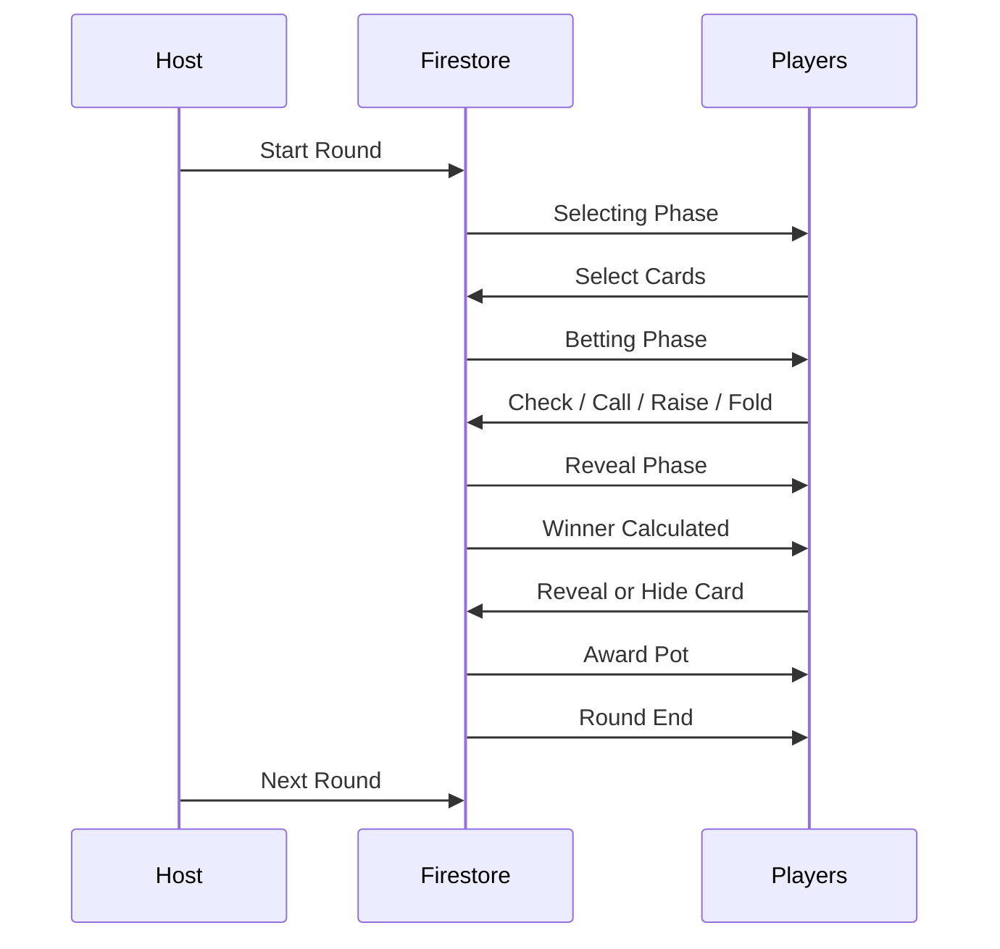

# Game Flow
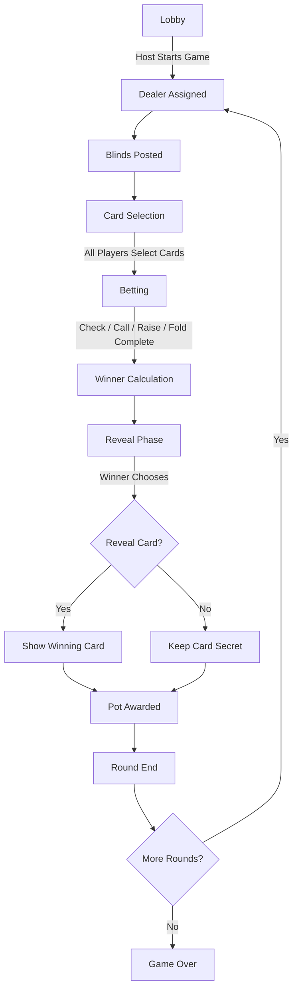

# File Responsibilities
## Components
**Game.jsx**
- Main game page and state listener.

**Lobby.jsx**
- Game creation and joining.

**CardGrid.jsx**
- 52-card selection grid.

**BettingPanel.jsx**
- Check, Call, Raise, Fold controls.

**GameInfoPanel.jsx**
- Round information and player status.

**RevealPanel.jsx**
- Winner reveal choice.

**RoundEndPanel.jsx**
- Round summary.

**GameOverPanel.jsx**
- Final rankings.

## Services
**gameService.js**
- Lobby management.

**roundService.js**
- Dealer assignment,
- blind posting,
- round initialization.

**cardService.js**
- Card selection.

**bettingService.js**
- Betting actions.

**revealService.js**
- Winner calculation and pot payout.

## Utilities
**deck.js**
- Deck generation and shuffling.

**ranking.js**
- Card comparison logic.

**pokerEngine.js**
- Dealer rotation, blind positions,
betting completion logic.

**gameHelpers.js**
Turn advancement helpers.

# Firestore Schema
## Firestore Collection Structure
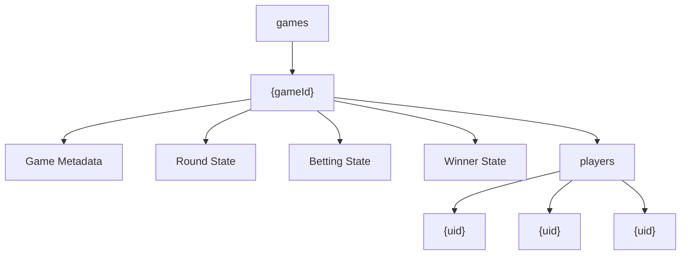

## Firestore Entity Relationship Diagram

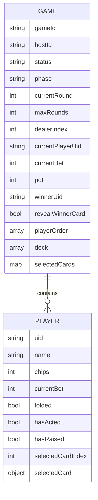

## Game Document Breakdown
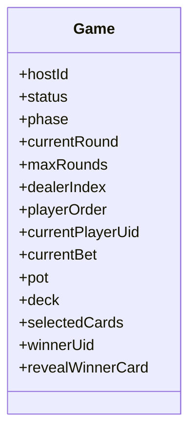

# The Engine
The game is implemented as a state machine.

- Firestore stores the current phase.

- Clients subscribe to the game document.

- The UI automatically changes based on phase.

**Valid phases:**
- lobby
- selecting
- betting
- reveal
- roundEnd
- gameOver

# Diagrams
## Overall System Architecture
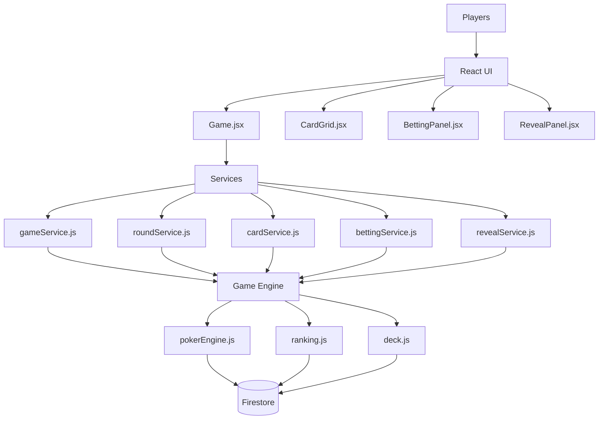

## Game Machine
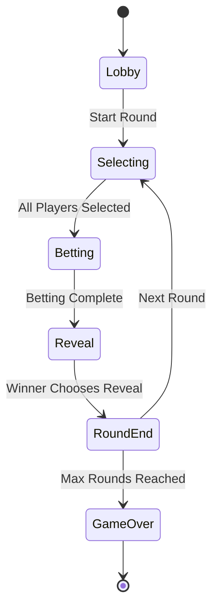

## Round Initialization
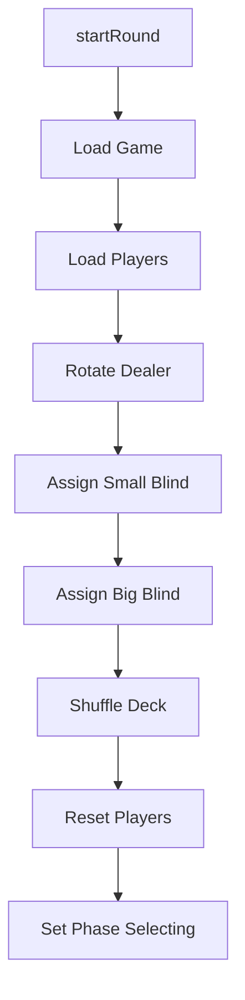

## Card Selection Flow
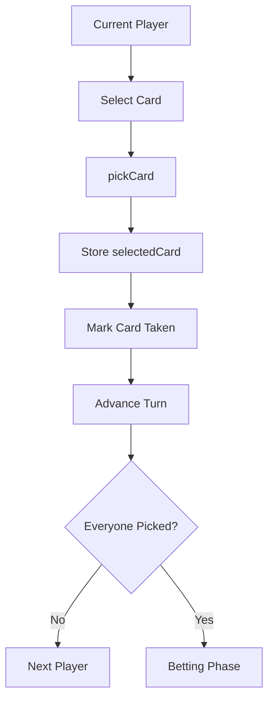

## Betting Engine
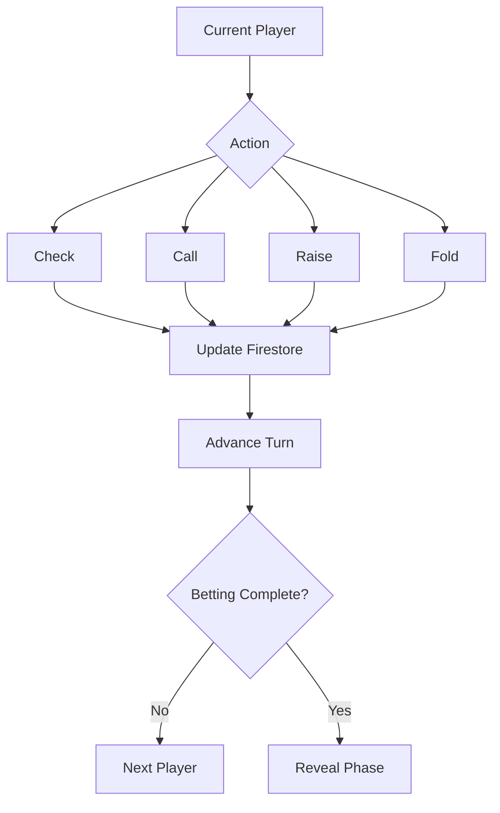

## Winner Determination
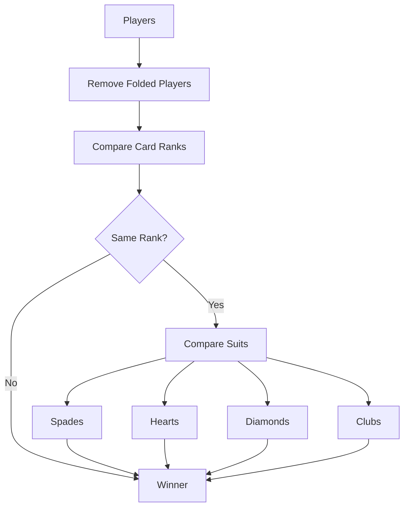

## Reveal Phase
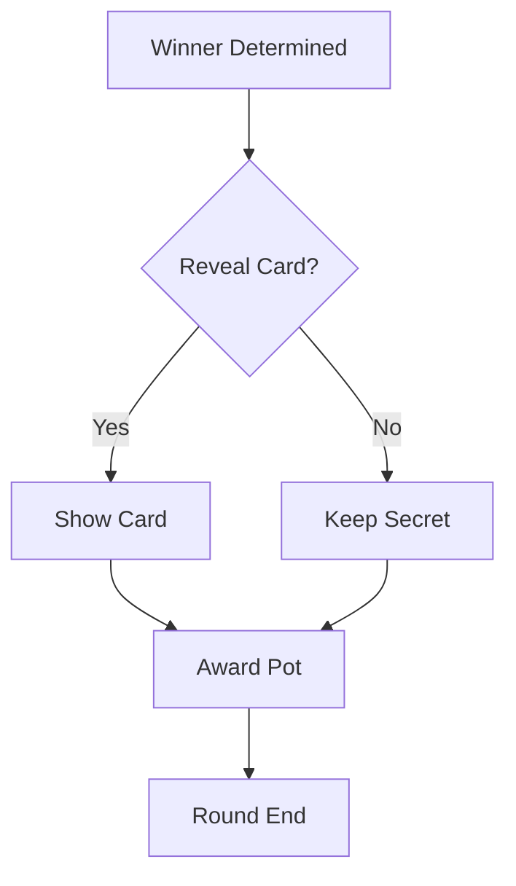

## Firestore Schema
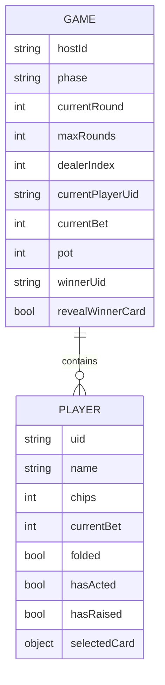

## Real-Time Synchronization
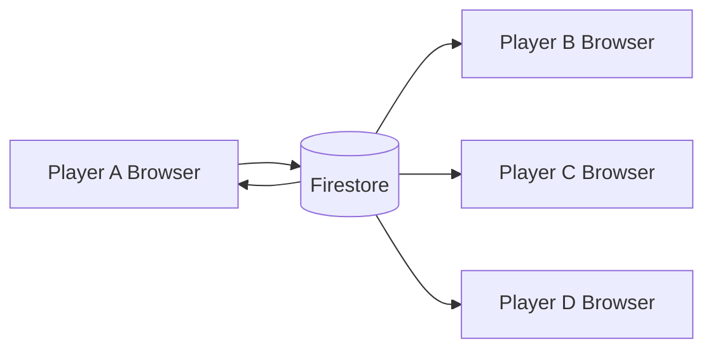

## Service Layer
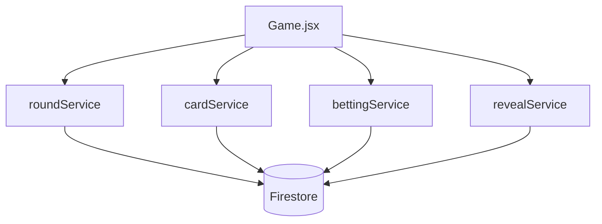